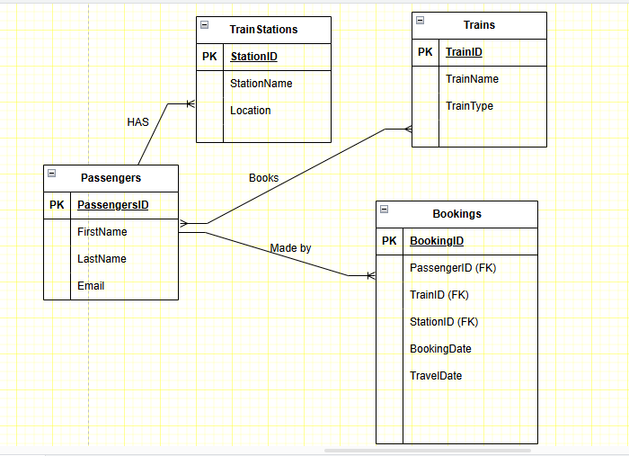

# Train Booking Database

## Group Name: Safaricom_Hook_Cohort_1_Peer_to_peer_Learning._Group_21
This project is a simple train booking system database, designed to manage bookings, passengers, trains, and stations.

## ERD

## Database Schema
- Tables: TrainStations, Passengers, Trains, Bookings
- Relationships: Bookings link Passengers, Trains, and Stations.

## Sample Data
Sample data has been inserted to simulate real-world usage.

## How to Run
1. Clone the repository.
2. Run the `booking.sql` file in your SQL database.
3. Query the tables to explore the data.

